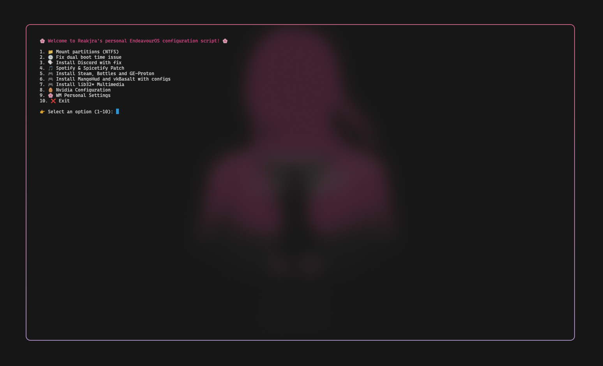

# 🌸 Scripts 🌸

> Testing scripts I'm saving to create an automatized file that does all my fixes/tweaks (Makes it faster.)


> To install and run the script:
```sh
curl -o reakjra.conf.sh https://raw.githubusercontent.com/reakjra/hyprland-personal-config/main/scripts/reakjra.conf.sh

chmod +x reakjra.conf.sh

reakjra.conf.sh
```


